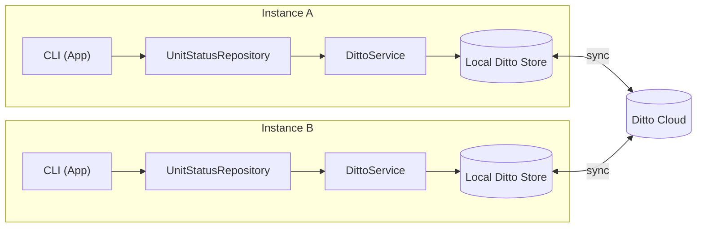
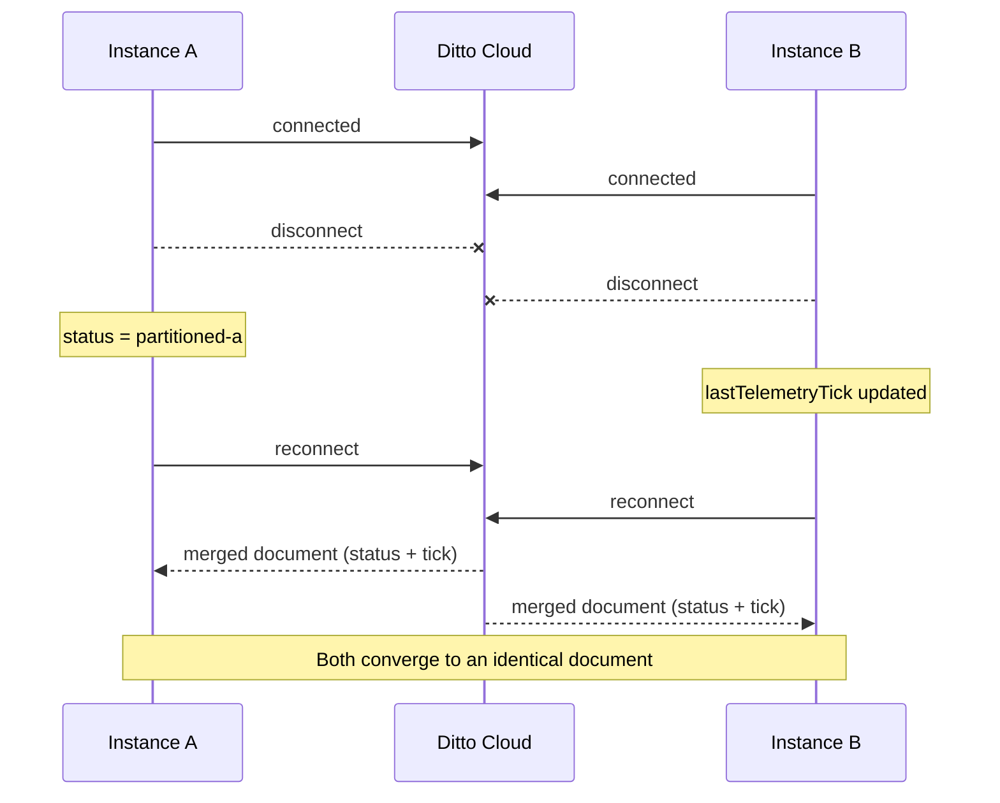

# Field Status Board

## Purpose

A CLI app for tracking field unit status - callsign, status, telemetry - synced in real time between instances via [Ditto](https://ditto.live). The core functionality is the ability of two disconnected instances to take concurrent edits to the same unit, and converge cleanly on reconnect without a central server arbitrating conflicts.

## Architecture



Each instance holds its own local Ditto store and stays fully functional
offline — the CLI talks only to `UnitStatusRepository`, which talks only to
`DittoService`, which is the only place the Ditto SDK's types are used
directly. Sync is cloud-mediated (local peer-to-peer/LAN discovery is
explicitly disabled — see Limitations).

### Partition and merge



Two instances can each take concurrent edits to *different fields* of the
same document while fully disconnected, and converge to a single merged
state on reconnect — proven in the [Demo](#demo-partition-and-reconnect)
section below.

## Roadmap

**Stage 1 (MVP - v0.1.0)**
- CLI scaffold, CI, toolchain verified
- Ditto SDK integration, auth, local read/write
- 'UnitStatus' domain model + repository (upsert, reads, targeted updates, tombstone/evict)
- Live board driven by local store observer
- Two-instance sync, partition/reconnect convergence demo
- Full CLI command loop ('report' / 'status' / 'tick' / 'list' / 'remove' / 'help')

**Stage 2+ (MMP - v0.2.0 - v0.3.0)**
- P2P transports (LAN mesh, no cloud dependency)
- Narrowed subscription scopes
- Explicit eviction policy
- Sync status monitoring
- Degraded-network testing with 'tc'/'netem'
- Web dashboard

## Setup

**Prerequisites:** JDK 17 and Gradle, installed via [SDKMAN](https://sdkman.io):
```bash
curl -s "https://get.sdkman.io" | bash
source "$HOME/.sdkman/bin/sdkman-init.sh"
sdk install java 17.0.13-tem
sdk install gradle 8.10.2
```

**Clone and configure:**
```bash
git clone <this repo's URL>
cd field-status-board
cp .env.sample .env
```

Edit `.env` and fill in `DITTO_ENDPOINT_URL`, `DITTO_DATABASE_ID`, and
`DITTO_AUTH_TOKEN` with credentials from your own [Ditto portal](https://portal.ditto.live)
database (Online Playground authentication mode). `.env` is gitignored —
never commit real credentials.

**Build and run:**
```bash
./gradlew build
./gradlew run --console=plain
```

The `--console=plain` flag is required for interactive use — Gradle's
default rich console UI redraws a live progress bar that collides with the
CLI's own prompt and input, corrupting what you type. Without it, the app
still runs, but typing at the `Enter Command: ` prompt will produce garbled output.

Type `help` at the prompt for the full command list.

## Limitations

**Development-only authentication.** This uses Ditto's Online Playground
auth mode — every device shares one token, with no per-user identity or
access control. Explicitly not recommended for production by Ditto's own
docs; fine for this demo, not a security model.

**`report` can silently clobber a concurrent targeted edit.** `report` is a
full-document upsert — it rewrites every field, not just the one you
mention. If two instances are partitioned and one uses `report` while the
other uses `status`/`tick` on the same field, the full upsert can overwrite
the targeted edit on reconnect. Only `status`/`tick`/`remove` are safe,
surgical operations during a partition; `report` is a full reset.

**No automated test suite.** Every behavior in this project — persistence,
upsert/conflict handling, targeted updates, tombstoning, sync, partition
recovery — was verified manually against the real Ditto Cloud backend and
documented in `NOTES.md`, not covered by unit or integration tests.

**No hardware/sensor ingestion.** Unit status is entered manually via the
CLI — there's no automated telemetry feed from real field hardware. Adding
one wouldn't require redesigning the sync layer: `UnitStatusRepository`
already decouples storage/sync from the CLI, so a hardware gateway would
just be another caller of the same repository methods, not new
architecture.

**Two instances on one machine require manual setup.** Running two
instances locally means passing a distinct instance name as an argument
(`./gradlew run --console=plain --args="a"`) so each gets its own local
Ditto store directory — this isn't automatic, and running without an
argument always uses one shared default location.

**No sync status visibility, degraded-network testing, or web dashboard**
— see Roadmap's Stage 2+ list; these are deliberately out of scope for
this MVP, not oversights.

## Demo: Partition and Reconnect

Proves two instances can each take concurrent edits to *different fields*
of the same document while fully disconnected, and converge to a single
merged state on reconnect — with zero manual conflict resolution.

**Setup:** two terminals, same project directory.

**Terminal 1:**
```bash
./gradlew run --console=plain --args="a"
```

**Terminal 2:**
```bash
./gradlew run --console=plain --args="b"
```

**Steps** (type these at each instance's prompt):

1. On **both** terminals, run `disconnect`. Confirm each prints
   `Disconnected (simulated partition).` before continuing — both sides
   must be offline before either edits anything.
2. On **Terminal 1 only**: `status ALPHA-1 partitioned-a`
3. On **Terminal 2 only**: `tick ALPHA-1`
4. On **both** terminals, run `reconnect`.
5. Wait a few seconds, then run `list` on **both** terminals.

**Observed result:** both terminals' `list` output converges to an
identical document — the `status` change from Terminal 1 and the
telemetry tick change from Terminal 2, both present together. Neither
edit is lost, and neither instance had to manually resolve a conflict;
Ditto's CRDT merge combined the two field-level changes automatically.

Only `status`/`tick` are safe to use mid-partition for this demo — see
Limitations for why `report` doesn't work the same way.
